# salesTracker - Sistema de Acompanhamento de Vendas para Vidraçaria

[](LICENSE)

Aplicação web para gerenciamento do fluxo de vendas e produção em vidraçaria, com controle de status de materiais (vidro/alumínio) e permissões hierárquicas.

## ✨ Funcionalidades

- **Dashboard de vendas** com filtros por:
  - Número do pedido
  - Cliente
  - Tipo de produto ( M2000, Portão automático, Portão de alumínio, Esquadria de alumínio com vidro )
  - Status ( Não iniciado, Em andamento, Finalizado )
- **Controle de materiais**:
  - Status do vidro ( Pendente medidas / Pendente projeto / Pendente pedido / Aguardando material / Aguardando agendamento / Finalizado )
  - Status do alumínio ( Pendente medidas / Pendente projeto / Pendente pedido / Aguardando material / Aguardando agendamento / Finalizado )
- **Hierarquia de usuários**:

  - **Admin**: Cria/edita/exclui pedidos e gerencia usuários
  - **Visualizador**: Apenas consulta o andamento

- **Histórico automático** de alterações com data/hora

## 🛠 Tecnologias

- **Frontend**:
  
  
  

- **Backend**:
  
  

## Diagrama

```mermaid
  flowchart TD
    A[Frontend React] -->|Consulta/Atualiza| B[(Firestore Database)]
    A -->|Autenticação| C[Firebase Auth]
    A -->|Chamadas específicas| D[Cloud Functions]
    B -->|Triggers| D
    D -->|Notificações| E[E-mail/WhatsApp]
    D -->|Logs| F[Firebase Console]

    subgraph Firebase
        B
        C
        D
    end

    subgraph Clientes
        G[Administrador] -->|CRUD Completo| A
        H[Visualizador] -->|Apenas Leitura| A
    end
```



## 🚀 Como Executar

1. **Pré-requisitos**:

   - Node.js v16+
   - Conta Firebase

2. **Configuração**:
   ```bash
   git clone https://github.com/erfilho/salesTracking.git
   cd salesTracker
   npm install
   ```
